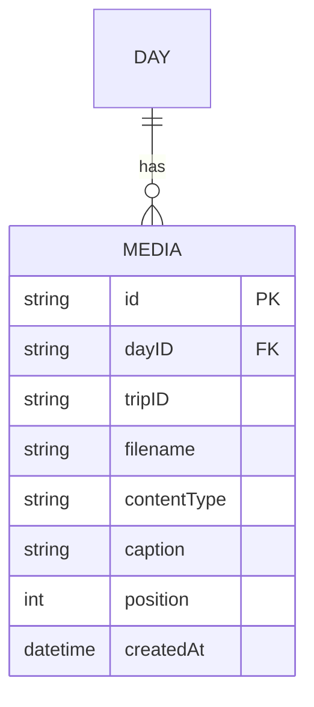

# feat: Add media management (photos & videos) for trip days

## Overview

Add a `media` bounded context to the backend and a `media` feature to the frontend, enabling admins to upload photos and videos to trip days, organize them via drag-and-drop, add captions, and enabling all users to browse galleries and view media in a fullscreen lightbox.

## Problem Frame

Trip days exist but have no associated visual content. Admins need to attach photos and videos to days. Visitors need to browse and view them. Files are stored on the NAS filesystem and served by the Go backend. (see origin: docs/brainstorms/2026-04-12-media-management-requirements.md)

## Requirements Trace

- R1. Upload photos (JPEG, PNG, WebP) and videos (MP4, MOV, WebM) via chunked resumable upload (tus protocol)
- R2. Store originals on NAS filesystem, serve via Go HTTP endpoints
- R3. Generate photo thumbnails (400px wide, JPEG 80%) on first access, cache on disk
- R4. Video thumbnails = static placeholder icon (no ffmpeg)
- R5. ~~EXIF extraction~~ — **deferred to a future iteration**
- R6. Caption field (optional text) editable by admin
- R7. Explicit ordering via `position` field, admin drag-and-drop reorder
- R8. Admin can delete media (original + thumbnail removed from disk)
- R9. Gallery grid in DayDrawer with play badge on videos
- R10. Fullscreen lightbox with prev/next navigation, native `<video>` for videos
- R11. Admin-only permissions for all write operations

## Scope Boundaries

- No HEIC support (deferred with EXIF)
- No video transcoding
- No video frame extraction for thumbnails
- No image editing (crop, rotation, filters)
- No albums beyond day grouping
- No individual media sharing
- Trip cover photo: separate workflow, out of scope

## Context & Research

### Relevant Code and Patterns

- **Bounded context reference**: `backend/internal/domain/day/` — 5-file pattern (model, command, query, repository, handler)
- **In-memory adapter**: `backend/internal/adapter/memory/day_repository.go` — deep copy, `sync.RWMutex`
- **Cross-context checker**: `day.TripChecker` interface, implemented by `memory.TripChecker`
- **GraphQL resolver wiring**: `backend/internal/graphql/schema.resolvers.go` — command → handler → payload pattern
- **Resolver root**: `backend/internal/graphql/resolver.go` — holds all domain handler pointers
- **HTTP server**: `backend/cmd/server/main.go` — `net/http` default mux, single `/query` route
- **Auth middleware**: `backend/internal/graphql/middleware.go` — Bearer token → context
- **Frontend hooks pattern**: `frontend/src/features/stages/hooks/useDayMutations.ts`
- **DayDrawer CSS**: already has `.gallery` and `.thumb` classes ready
- **Lightbox lib**: `yet-another-react-lightbox` already in `package.json`

### External References

- `disintegration/imaging` — pure Go image resizing, no CGO
- `tus/tusd` v2 — resumable upload Go server, embeds as `http.Handler`
- `tus-js-client` — lightweight JS upload client with automatic resume
- tus protocol spec: https://tus.io/protocols/resumable-upload

## Key Technical Decisions

- **Upload protocol**: tus.io via `tusd` v2 embedded handler + `tus-js-client`. Provides automatic resume, offset tracking, and chunk reassembly out of the box. Avoids reimplementing resume logic.
- **File serving**: Go backend serves files via REST endpoints (`GET /media/:id`, `GET /media/:id/thumb`). Auth middleware reused from GraphQL layer.
- **Thumbnail generation**: `disintegration/imaging` (pure Go). Generated lazily on first `GET /media/:id/thumb`, then cached as a file on disk alongside the original.
- **NAS directory structure**: `<MEDIA_BASE>/trips/<tripID>/days/<dayID>/<mediaID>.<ext>` with thumbnails at `<MEDIA_BASE>/trips/<tripID>/days/<dayID>/thumbs/<mediaID>.jpg`.
- **GraphQL for metadata CRUD**: Mutations for caption update, reorder, delete. Upload itself goes through tus REST endpoint, and on upload completion the backend creates the Media entity via a domain command.
- **Reorder mechanism**: `reorderMedia(dayID: ID!, mediaIDs: [ID!]!)` mutation — client sends the full ordered list of IDs, backend overwrites positions. Simpler and more reliable than per-item position moves.
- **Video thumbnails**: Static SVG placeholder served by the backend (no ffmpeg dependency). The frontend shows a play badge overlay on video thumbnails in the gallery grid.
- **Auth for REST endpoints**: Extract the Bearer token parsing from `graphql/middleware.go` into a shared `internal/middleware/` package so both GraphQL and media REST handlers can use it. The media upload and delete endpoints require admin role; the serving endpoints (original + thumb) are public.

## Open Questions

### Resolved During Planning

- **Chunking protocol**: tus.io — standard, battle-tested, embeds in Go, JS client available.
- **NAS directory structure**: `trips/<tripID>/days/<dayID>/<mediaID>.<ext>` — organized by trip/day, easy to browse and clean up.
- **Image resize lib**: `disintegration/imaging` — pure Go, handles JPEG/PNG/WebP, no CGO.
- **Reorder mutation**: `reorderMedia(dayID, mediaIDs)` — full list replacement, simple.

### Deferred to Implementation

- Exact tusd configuration options (max upload size, chunk size, cleanup of incomplete uploads)
- Whether tus metadata (dayID, tripID) should be validated before accepting the upload or only on completion
- Pagination strategy for days with very many media items (likely unnecessary for V1)

## High-Level Technical Design

> *This illustrates the intended approach and is directional guidance for review, not implementation specification. The implementing agent should treat it as context, not code to reproduce.*

```
Upload flow:
  React (tus-js-client)
    │ POST /api/upload  (tus: create)
    │ PATCH /api/upload/:uploadID  (tus: chunks)
    ▼
  tusd handler (Go, embedded in main.go)
    │ on complete → read tus metadata (dayID, tripID, filename, contentType)
    ▼
  media.Handler.AddMedia(ctx, AddMediaCommand{...})
    │ validate day exists + trip modifiable
    │ create Media entity (ID, dayID, filename, contentType, position)
    │ move file from tusd upload dir → NAS directory
    ▼
  media.Repository.Save(ctx, media)

Serving flow:
  GET /media/:id
    │ look up Media by ID
    │ resolve file path on NAS
    │ stream file with Content-Type header
    ▼
  GET /media/:id/thumb
    │ if photo: check thumb cache → generate if missing → serve JPEG
    │ if video: serve static SVG placeholder

Metadata CRUD (GraphQL):
  mutation updateMediaCaption(id, caption) → MediaPayload
  mutation reorderMedia(dayID, mediaIDs) → ReorderMediaPayload
  mutation deleteMedia(id) → DeleteMediaPayload
  query dayMedia(dayID) → [Media!]!
```



## Implementation Units

### Phase 1: Backend Domain + Storage

- [ ] **Unit 1: Media domain model, commands, queries, and repository port**

  **Goal:** Create the `media` bounded context with the entity, commands, queries, and repository interface following the `day/` pattern.

  **Requirements:** R1, R2, R6, R7

  **Dependencies:** None

  **Files:**
  - Create: `backend/internal/domain/media/model.go`
  - Create: `backend/internal/domain/media/command.go`
  - Create: `backend/internal/domain/media/query.go`
  - Create: `backend/internal/domain/media/repository.go`
  - Create: `backend/internal/domain/media/storage.go` (Storage port interface)
  - Create: `backend/internal/domain/media/handler.go`
  - Test: `backend/internal/domain/media/handler_test.go`

  **Approach:**
  - `Media` entity: ID, DayID, TripID, Filename, ContentType, Caption, Position, CreatedAt
  - `NewMedia(...)` constructor with validation (content type whitelist: JPEG, PNG, WebP, MP4, MOV, WebM)
  - `Update(caption)` and `IsPhoto() bool` / `IsVideo() bool` helper methods
  - Commands: `AddMediaCommand`, `UpdateCaptionCommand`, `ReorderCommand`, `DeleteMediaCommand`
  - Queries: `GetMediaQuery`, `ListByDayQuery`
  - Repository port: `Save`, `FindByID`, `ListByDay`, `Delete`, `Reorder(dayID, orderedIDs)`
  - Storage port: `Store(id, tripID, dayID, ext string, reader io.Reader) error`, `Delete(id, tripID, dayID, ext string) error`, `FilePath(id, tripID, dayID, ext string) string`, `ThumbPath(id, tripID, dayID string) string`
  - Handler needs `TripChecker` and `DayChecker` cross-context ports (day exists, trip is modifiable)
  - Handler.AddMedia: validate trip modifiable, assign next position, create entity, call repo.Save
  - Handler.Reorder: validate all IDs belong to the day, update positions

  **Patterns to follow:**
  - `backend/internal/domain/day/model.go` — entity + sentinel errors
  - `backend/internal/domain/day/handler.go` — handler with checker dependencies

  **Test scenarios:**
  - Add media to a day → media created with correct position (next after existing)
  - Add media with invalid content type → error
  - Update caption → caption updated
  - Reorder → positions updated in order
  - Reorder with missing ID → error
  - Delete → media removed
  - Add media to non-modifiable trip → error

  **Verification:** All handler tests pass. Domain model correctly validates content types and manages positions.

- [ ] **Unit 2: In-memory media repository + filesystem storage adapter**

  **Goal:** Implement the in-memory repository for dev/test and a filesystem storage adapter for the NAS.

  **Requirements:** R2, R3, R8

  **Dependencies:** Unit 1

  **Files:**
  - Create: `backend/internal/adapter/memory/media_repository.go`
  - Create: `backend/internal/adapter/filesystem/storage.go`
  - Test: `backend/internal/adapter/filesystem/storage_test.go`

  **Approach:**
  - In-memory repo: `sync.RWMutex` + `map[string]*media.Media`, deep copy pattern, `Reorder` updates positions in-place
  - Filesystem storage: base path from config, creates dirs `<base>/trips/<tripID>/days/<dayID>/`, stores files as `<mediaID>.<ext>`, thumbs in `thumbs/` subdirectory
  - `Delete` removes both original and thumbnail files
  - `DayChecker` port implementation in memory adapter (verify day exists)

  **Patterns to follow:**
  - `backend/internal/adapter/memory/day_repository.go` — mutex + deep copy
  - Directory creation: `os.MkdirAll` with `0755` permissions

  **Test scenarios:**
  - Store file → file appears at expected path
  - Delete file → file and thumbnail removed
  - FilePath returns correct path structure
  - In-memory repo CRUD operations

  **Verification:** Storage adapter reads/writes to temp directories in tests. In-memory repo passes same interface contract as domain tests.

- [ ] **Unit 3: Thumbnail generation service**

  **Goal:** Implement lazy thumbnail generation for photos, with static placeholder for videos.

  **Requirements:** R3, R4

  **Dependencies:** Unit 2

  **Files:**
  - Create: `backend/internal/domain/media/thumbnailer.go` (port interface)
  - Create: `backend/internal/adapter/imaging/thumbnailer.go`
  - Create: `backend/internal/adapter/imaging/video_placeholder.go`
  - Test: `backend/internal/adapter/imaging/thumbnailer_test.go`

  **Approach:**
  - Thumbnailer port: `GenerateThumb(originalPath, thumbPath string) error`
  - Photo thumbnailer: `disintegration/imaging` — open image, resize to 400px wide (preserve aspect ratio), save as JPEG quality 80
  - Video placeholder: generate a static dark SVG/PNG with a play icon, save to thumbPath. Generate once at startup and reuse.
  - Thumb serving logic: check if thumb file exists on disk → if not, generate → serve file. This lives in the HTTP handler (Unit 5), not here.

  **Patterns to follow:**
  - Keep the thumbnailer as a port/adapter to allow swapping to ffmpeg later

  **Test scenarios:**
  - Generate thumbnail from JPEG → 400px wide JPEG at expected path
  - Generate thumbnail from PNG → JPEG output
  - Video placeholder → valid image file at expected path

  **Verification:** Thumbnails generated with correct dimensions and format. Video placeholder is a valid image.

### Phase 2: Backend HTTP Layer

- [ ] **Unit 4: Shared auth middleware + tus upload endpoint**

  **Goal:** Extract auth middleware to shared package, add tus upload handler, and wire upload completion to domain.

  **Requirements:** R1, R11

  **Dependencies:** Unit 1, Unit 2

  **Files:**
  - Create: `backend/internal/middleware/auth.go`
  - Modify: `backend/internal/graphql/middleware.go` — delegate to shared middleware
  - Modify: `backend/cmd/server/main.go` — add tus routes, wire upload completion
  - Test: `backend/internal/middleware/auth_test.go`

  **Approach:**
  - Extract `AuthMiddleware` and `WithSessionToken`/`SessionTokenFromContext` into `internal/middleware/`
  - GraphQL middleware becomes a thin wrapper calling the shared middleware
  - Create `AdminOnly(handler)` middleware that checks role from context (calls auth handler to resolve token → account → role)
  - Mount tusd handler at `/api/upload/` with `AdminOnly` middleware
  - tus metadata fields: `dayID`, `tripID`, `filename`, `contentType`
  - On upload completion (tusd `CompleteUploads` channel): goroutine reads metadata, calls `media.Handler.AddMedia`, moves file from tusd upload dir to NAS storage via Storage adapter
  - CORS middleware must also wrap the new routes

  **Patterns to follow:**
  - `backend/cmd/server/main.go` — current route registration pattern

  **Test scenarios:**
  - Upload without auth → 401
  - Upload with non-admin token → 403
  - Upload with admin token → accepted
  - Upload completion → Media entity created in repository, file moved to NAS path

  **Verification:** tus upload endpoint accepts chunked uploads from authenticated admin users. Upload completion triggers media creation.

- [ ] **Unit 5: Media serving endpoints (original + thumbnail)**

  **Goal:** Add REST endpoints to serve media files and thumbnails.

  **Requirements:** R2, R3, R4

  **Dependencies:** Unit 2, Unit 3

  **Files:**
  - Create: `backend/internal/http/media_handler.go`
  - Modify: `backend/cmd/server/main.go` — register media serving routes

  **Approach:**
  - `GET /media/{id}` — look up Media by ID in repository, resolve file path, serve with correct `Content-Type` and `Content-Disposition` headers
  - `GET /media/{id}/thumb` — check thumb cache on disk, if missing generate via Thumbnailer, serve JPEG
  - These endpoints are public (no auth required) — media visibility is controlled by knowing the ID
  - Use `http.ServeFile` or `http.ServeContent` for efficient file serving with range request support (important for video seeking)
  - Set `Cache-Control` headers for thumbnails (long TTL since they're immutable)

  **Patterns to follow:**
  - Standard Go `net/http` handler pattern

  **Test scenarios:**
  - GET existing media → 200 with correct content type
  - GET non-existent media → 404
  - GET thumb for photo (first time) → thumbnail generated and served
  - GET thumb for photo (cached) → served directly
  - GET thumb for video → placeholder served
  - Range request on video → partial content response

  **Verification:** Media files and thumbnails served with correct headers. Thumbnails lazily generated and cached.

- [ ] **Unit 6: GraphQL schema + resolvers for media metadata**

  **Goal:** Add GraphQL types, queries, and mutations for media metadata CRUD.

  **Requirements:** R6, R7, R8, R11

  **Dependencies:** Unit 1

  **Files:**
  - Modify: `backend/api/schema.graphqls`
  - Modify: `backend/internal/graphql/resolver.go` — add `mediaHandler`
  - Modify: `backend/internal/graphql/schema.resolvers.go` — new resolvers
  - Modify: `backend/internal/graphql/helpers.go` — `toGraphQLMedia`
  - Modify: `backend/internal/graphql/errors.go` — media error mapping
  - Regenerate: `backend/internal/graphql/generated.go`
  - Regenerate: `backend/internal/graphql/models_gen.go`

  **Approach:**
  - Schema additions:
    - `type Media { id, dayID, filename, contentType, caption, url, thumbUrl, position, createdAt }`
    - `url` and `thumbUrl` are computed fields (resolver-level, based on media ID)
    - `query dayMedia(dayID: ID!): [Media!]!`
    - `mutation updateMediaCaption(id: ID!, caption: String): MediaPayload`
    - `mutation reorderMedia(dayID: ID!, mediaIDs: [ID!]!): ReorderMediaPayload`
    - `mutation deleteMedia(id: ID!): DeleteMediaPayload`
  - `ReorderMediaPayload { media: [Media!]!, errors: [UserError!]! }`
  - Delete mutation also calls Storage.Delete to remove files
  - Admin-only check in resolvers for all mutations (same pattern as existing trip mutations)

  **Patterns to follow:**
  - `backend/internal/graphql/schema.resolvers.go` — command → handler → payload
  - `backend/internal/graphql/helpers.go` — `toGraphQLTrip` / `toGraphQLDay` pattern

  **Test scenarios:**
  - Query dayMedia → returns sorted list
  - Update caption → caption changed
  - Reorder → new order persisted
  - Delete → media removed from repo + storage
  - Mutations by non-admin → error

  **Verification:** GraphQL playground shows new types. Mutations work for admin, are rejected for non-admin.

### Phase 3: Frontend

- [ ] **Unit 7: GraphQL codegen + media hooks**

  **Goal:** Generate TypeScript types for the new media schema and create data-fetching hooks.

  **Requirements:** R9, R10, R11

  **Dependencies:** Unit 6

  **Files:**
  - Regenerate: `frontend/src/graphql/generated/` (via `npm run codegen`)
  - Create: `frontend/src/features/media/hooks/useMediaQueries.ts`
  - Create: `frontend/src/features/media/hooks/useMediaMutations.ts`

  **Approach:**
  - `useDayMedia(dayID)` hook wrapping `useQuery` for `dayMedia` query
  - `useUpdateCaption()`, `useReorderMedia()`, `useDeleteMedia()` mutation hooks
  - Follow exact pattern from `frontend/src/features/stages/hooks/useDayMutations.ts`

  **Patterns to follow:**
  - `frontend/src/features/stages/hooks/useDayMutations.ts`
  - `frontend/src/features/stages/hooks/useTripDays.ts`

  **Verification:** Hooks compile, types match schema.

- [ ] **Unit 8: Upload component with tus-js-client**

  **Goal:** Create a media upload UI with progress indicator and multi-file support.

  **Requirements:** R1, R11

  **Dependencies:** Unit 4, Unit 7

  **Files:**
  - Create: `frontend/src/features/media/components/MediaUploader.tsx`
  - Create: `frontend/src/features/media/components/MediaUploader.module.css`

  **Approach:**
  - Install `tus-js-client` as dependency
  - Drop zone or file input accepting photos (JPEG, PNG, WebP) and videos (MP4, MOV, WebM)
  - Multi-file: each file gets its own tus Upload instance with progress tracking
  - Progress bar per file showing upload percentage
  - tus metadata: `dayID`, `tripID`, `filename`, `contentType`
  - Auth: pass Bearer token in tus upload headers
  - On success: invalidate/refetch dayMedia query
  - Admin-only: component not rendered for non-admin users

  **Patterns to follow:**
  - CSS Modules pattern from existing form components

  **Test scenarios:**
  - Select multiple files → individual progress bars
  - Upload completes → gallery refreshes with new media
  - Connection drop → resume on retry
  - Non-admin → upload UI not visible

  **Verification:** Admin can upload files, see progress, and media appears in gallery after completion.

- [ ] **Unit 9: Gallery grid in DayDrawer**

  **Goal:** Display media gallery in the DayDrawer with thumbnails, play badges, and admin actions.

  **Requirements:** R9, R11

  **Dependencies:** Unit 7, Unit 8

  **Files:**
  - Modify: `frontend/src/features/trips/components/DayDrawer.tsx`
  - Modify: `frontend/src/features/trips/components/DayDrawer.module.css` (minor additions for play badge)
  - Create: `frontend/src/features/media/components/MediaGallery.tsx`
  - Create: `frontend/src/features/media/components/MediaGallery.module.css`

  **Approach:**
  - `MediaGallery` component receives media list + admin flag as props
  - Renders thumbnail grid using existing `.gallery` / `.thumb` CSS classes in DayDrawer
  - Videos: overlay a play icon badge on the thumbnail
  - DayDrawer fetches `dayMedia` via hook and passes data to `MediaGallery`
  - Admin mode: show upload button (opens MediaUploader) and delete button on hover
  - Click on thumbnail → open lightbox (Unit 10)

  **Patterns to follow:**
  - `DayDrawer.module.css` — existing `.gallery` and `.thumb` classes
  - Data flows via props, not component-level fetching

  **Test scenarios:**
  - Day with media → grid of thumbnails shown
  - Day without media → empty state message
  - Video media → play badge visible
  - Admin → upload button visible
  - Non-admin → no upload/delete controls

  **Verification:** Gallery renders correctly with mixed photo/video content. Admin controls visible only for admin users.

- [ ] **Unit 10: Lightbox with prev/next navigation**

  **Goal:** Fullscreen lightbox for viewing photos and videos with keyboard/swipe navigation.

  **Requirements:** R10

  **Dependencies:** Unit 9

  **Files:**
  - Create: `frontend/src/features/media/components/MediaLightbox.tsx`
  - Create: `frontend/src/features/media/components/MediaLightbox.module.css`

  **Approach:**
  - Use `yet-another-react-lightbox` (already installed)
  - Photos: render as `` slides
  - Videos: use the library's custom render to show native `<video>` element with controls
  - Navigation: prev/next arrows + keyboard (left/right) + swipe on mobile
  - Caption displayed below the media
  - Close on backdrop click or Escape key
  - Open from MediaGallery thumbnail click, starting at the clicked index

  **Patterns to follow:**
  - `yet-another-react-lightbox` documentation for custom video slides

  **Test scenarios:**
  - Click photo thumbnail → lightbox opens at that photo
  - Navigate next/prev → correct media shown
  - Video in lightbox → native player with controls
  - Caption visible below media
  - Close via Escape or backdrop click
  - Mobile swipe navigation

  **Verification:** Lightbox opens, navigates, and closes correctly for both photos and videos.

- [ ] **Unit 11: Drag-and-drop reorder + caption editing**

  **Goal:** Admin can reorder media via drag-and-drop and edit captions inline.

  **Requirements:** R6, R7, R11

  **Dependencies:** Unit 9

  **Files:**
  - Modify: `frontend/src/features/media/components/MediaGallery.tsx`
  - Modify: `frontend/src/features/media/components/MediaGallery.module.css`

  **Approach:**
  - Drag-and-drop: use HTML Drag and Drop API on the gallery grid (no library needed for a simple grid reorder)
  - On drop: reorder items locally for optimistic UI, then call `reorderMedia` mutation with new ID order
  - Caption editing: click on a media item's caption area → inline text input → blur or Enter saves via `updateMediaCaption` mutation
  - Admin-only: drag handles and caption edit affordances only visible for admin users

  **Patterns to follow:**
  - Optimistic UI pattern: update local state immediately, revert on mutation error

  **Test scenarios:**
  - Drag media A before media B → order updated, persisted on reload
  - Edit caption → saved, visible in gallery and lightbox
  - Reorder fails (network) → reverted to previous order
  - Non-admin → no drag handles, no caption editing

  **Verification:** Drag-and-drop reorders persist across page reloads. Captions save and display correctly.

## System-Wide Impact

- **HTTP routing**: New REST routes (`/api/upload/`, `/media/`) added alongside existing `/query`. CORS middleware must wrap all routes.
- **Auth middleware**: Extracted to shared `internal/middleware/` package. GraphQL middleware becomes a thin wrapper — must verify no regression in existing auth flow.
- **State lifecycle**: Upload completion (tus) triggers domain command asynchronously. If the domain command fails, the uploaded file must be cleaned up (orphan file risk).
- **Error propagation**: GraphQL media mutations follow existing error pattern (domain errors → UserError). REST endpoints use standard HTTP status codes (400, 401, 403, 404, 500).
- **API surface parity**: Media metadata CRUD is GraphQL. File upload/serving is REST. This is a new pattern in the codebase — document it clearly.
- **Frontend cache invalidation**: After upload completion or delete, the `dayMedia` query cache must be invalidated to refresh the gallery.

## Risks & Dependencies

- **tusd integration complexity**: tusd embeds as an http.Handler but has its own middleware expectations. May conflict with existing CORS wrapper — test early.
- **Large file memory usage**: tusd's `filestore` backend writes chunks to disk, not memory. But the completion handler must read tus metadata — verify this doesn't buffer the entire file.
- **Thumbnail generation blocking**: First request for a thumbnail triggers generation. For large photos this could be slow (~200ms). Consider generating thumbnails in the upload completion handler instead of lazily.
- **Go dependency additions**: `disintegration/imaging`, `tus/tusd` v2, `tus-js-client` (npm). These are well-maintained but add binary size (~2-3MB for tusd).

## Sources & References

- **Origin document:** [docs/brainstorms/2026-04-12-media-management-requirements.md](../brainstorms/2026-04-12-media-management-requirements.md)
- Architecture spec: `specs/web-application/choix-techniques.md`
- Domain reference: `backend/internal/domain/day/`
- Adapter reference: `backend/internal/adapter/memory/day_repository.go`
- GraphQL resolver reference: `backend/internal/graphql/schema.resolvers.go`
- Libraries: [disintegration/imaging](https://github.com/disintegration/imaging), [tus/tusd](https://github.com/tus/tusd), [tus-js-client](https://github.com/tus/tus-js-client), [yet-another-react-lightbox](https://github.com/igordanchenko/yet-another-react-lightbox)
