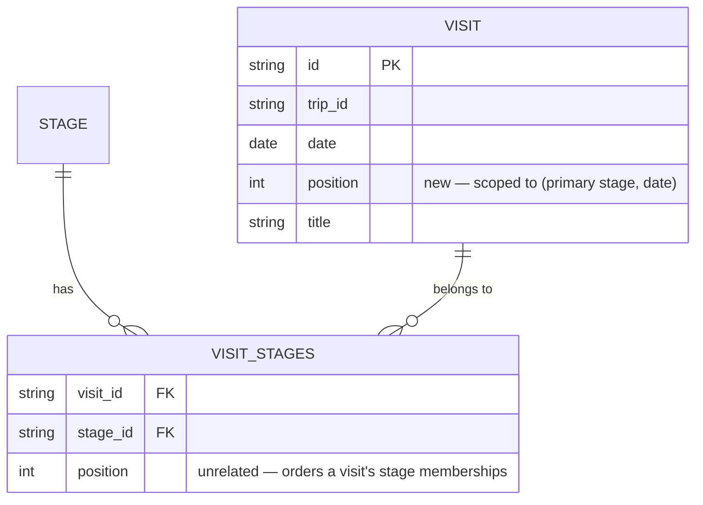

# feat: Order visits within the same day

## Overview

Add an explicit, user-controlled ordering of visits that share the same primary stage and the same date. Backend gains a `Position` field on `Visit`, scoped per `(primary stageID, date)` group, plus a `reorderVisits` mutation. Frontend gains drag-and-drop reordering within a day's visit list, reusing the native HTML5 drag pattern already implemented for media.

## Problem Frame

Visits are currently ordered only by `Date` (backend `sort.Slice` by `Date.Before` in `visit.Handler.ListByStage`/`ListByTrip`). When several visits share the same date, their relative order is undefined (whatever the repository iteration/query happens to return). The user wants to control that order explicitly and reorder it via drag-and-drop, with new visits defaulting to the end of their day's list.

## Requirements Trace

- R1. Visits sharing the same primary stage and date can be explicitly ordered relative to each other via a persisted `position`.
- R2. An editor/admin can reorder same-day visits via drag-and-drop in the frontend.
- R3. A newly created visit defaults to the last position within its `(stage, date)` group, plus one.
- R4. Reordering one `(stage, date)` group never affects position values of visits in other groups (other dates, other stages, other trips).
- R5. Editing a visit's date, or a detach that changes its primary stage, moves it to the end of its new group rather than leaving it in an invalid or colliding position.

## Scope Boundaries

- No manual reordering across different dates or different stages — drag is confined to one `(stage, date)` group, matching how the mutation is scoped.
- No "move up/down" buttons — drag-and-drop only, per explicit request.
- No change to `Stage` ordering or to `Media` ordering — this plan is `Visit`-only.
- The existing `visit_stages.position` column (order of a visit's *stage memberships*, for multi-stage visits) is unrelated and untouched — do not confuse the two concepts.
- No new frontend test tooling — the project currently has zero frontend automated tests (no Vitest/Jest/RTL in `frontend/package.json`); this plan does not change that convention.
- No new npm dependency — no `dnd-kit`/`react-beautiful-dnd` is added; the existing hand-rolled HTML5 drag pattern is reused.

## Context & Research

### Relevant Code and Patterns

- **Visit domain**: `backend/internal/domain/visit/model.go` — `Visit{ID, TripID, StageIDs []string, Date, Title, Description, Lat, Lng, CreatedAt, UpdatedAt}`, no position field today. `NewVisit` (line 36), `Update` (line 65), `AttachToStage`/`DetachFromStage` (lines 83, 97).
- **Visit handler**: `backend/internal/domain/visit/handler.go` — `Add`, `Update`, `Delete`, `AttachToStage`, `DetachFromStage`, `ListByStage`/`ListByTrip` (sort by `Date` only, lines 186-188 and 200-202).
- **Visit repository port**: `backend/internal/domain/visit/repository.go`.
- **Direct precedent to mirror — Media ordering**: `Media.Position int` (`backend/internal/domain/media/model.go:37`), `Repository.NextPosition`/`Repository.Reorder` (`backend/internal/domain/media/repository.go:13-15`), `Handler.Add` assigns `NextPosition` (`handler.go:49`), `Handler.Reorder` validates the full ID set before persisting (`handler.go:92-141`), memory adapter implementation (`backend/internal/adapter/memory/media_repository.go:85-108`), GraphQL `reorderMedia(visitID: ID!, mediaIDs: [ID!]!): ReorderMediaPayload!` (`backend/api/schema.graphqls:318`), resolver (`backend/internal/graphql/schema.resolvers.go:404-417`) — auth via `requireEditor`, domain errors always returned in the payload's `errors` field (never as a transport error).
- **Postgres visit adapter**: `backend/internal/adapter/postgres/visit_repository.go` — `visits` table (id, trip_id, date, title, description, lat, lng, created_at, updated_at), separate `visit_stages(visit_id, stage_id, position)` junction table that orders a visit's *stage memberships*, unrelated to this feature.
- **Migrations**: golang-migrate v4 (`backend/go.mod`), run via `RunMigrations` (`backend/internal/adapter/postgres/db.go:29`) from `main.go:97`. Naming: `NNNNNN_description.up.sql`/`.down.sql`, embedded flatly via `backend/migrations/embed.go`. Next number: `000003`.
- **GraphQL schema**: `type Visit` (`backend/api/schema.graphqls:114-132`), dates are modeled as `String!` in `"YYYY-MM-DD"` format throughout (not a custom scalar) — `AddVisitInput.date: String!` (line 148), parsed inline in resolvers via `time.Parse(time.DateOnly, ...)` (`schema.resolvers.go:203, 231`; `dateFormat = time.DateOnly` in `helpers.go:15`). No shared `parseDate` helper exists.
- **Error mapping**: `backend/internal/graphql/errors.go:52-61` (`visit` sentinel cases) and `:95` (`media.ErrIDMismatch` pattern, `Field: strPtr("mediaIDs")`) — mirror this for a new `visit.ErrReorderIDMismatch` case with `Field: strPtr("visitIDs")`.
- **Frontend grouping**: `StageSection` in `frontend/src/features/trips/pages/TripDetailPage.tsx:598-622` filters `primaryVisits = visits.filter(v => v.stageIDs[0] === stage.id)` then maps directly to `VisitRow` (line 617) — no sub-grouping by date today, no sort call (relies on backend order).
- **Frontend drag-and-drop precedent**: `frontend/src/features/media/components/MediaGallery.tsx` — `dragItem`/`dragOverItem` refs (lines 20-21), `handleDragStart`/`handleDragOver`/`handleDrop` (lines 43-74), optimistic local state (`localMedia`) with revert-on-error, native `draggable`/`onDragStart`/`onDragOver`/`onDrop` JSX (lines 100-103). Mutation hook precedent: `useReorderMedia` imported from `frontend/src/features/media/hooks/useMediaMutations.ts`.
- **Frontend mutation hooks**: `frontend/src/features/stages/hooks/useVisitMutations.ts` — `useMutation` from `urql` + generated `gql` tag, `useAddVisit`/`useUpdateVisit`/`useDeleteVisit`.
- **Gherkin spec**: `specs/web-application/gestion-des-etapes-et-visites.feature:196-212`, section `# --- Ordre et navigation ---`, existing scenario "Les visites d'une étape sont triées par date" (line 198). Backend test mirror: `backend/internal/domain/visit/testdata/visit.feature`, step defs in `backend/internal/domain/visit/steps_list_test.go` (`stageContainsVisits`, `visitsAreInOrder`).

### Institutional Learnings

- No `docs/solutions/` directory exists yet in this repo — nothing to consult.

## Key Technical Decisions

- **Field name `Position int`, not `order`**: mirrors the existing `Media.Position` convention exactly and avoids `order` being a SQL reserved word.
- **Grouping key is `(primary stageID, date)`, not global or stage-only**: `StageIDs[0]` is the "primary stage" (already the concept the frontend uses to decide which `StageSection` renders a visit — `TripDetailPage.tsx:600`). Scoping position to this pair matches both the frontend's existing grouping and the user's stated requirement ("order visits of the same day").
- **`NextPosition`/`Reorder` on the repository port, scoped by `(stageID, date)`**: directly mirrors `media.Repository.NextPosition(ctx, visitID)` / `Reorder(ctx, visitID, orderedIDs)`, replacing the single `visitID` scope key with the `(stageID, date)` pair.
- **Date equality via `time.Time.Equal`, not string formatting**: safe because every code path that produces a `Visit.Date` parses it with `time.Parse(time.DateOnly, ...)`, so all dates are already normalized to UTC midnight — no time-of-day/timezone drift risk to guard against.
- **`reorderVisits(stageID: ID!, date: String!, visitIDs: [ID!]!)`**: `date` is `String!` to match the schema's existing convention of modeling dates as strings, not `Date!` (no custom scalar exists in this schema).
- **Group-change side effect (resolves the open question from earlier discussion)**: when `Handler.Update` changes a visit's `Date` such that it leaves its current `(stageID, date)` group, or `Handler.DetachFromStage` changes `StageIDs[0]` (the primary stage), the handler recomputes `Position` via `NextPosition` for the *new* group and appends the visit at its end. `AttachToStage` always appends to `StageIDs`, so `StageIDs[0]` never changes there — no recompute needed. The vacated position in the old group is left as a gap; this is harmless because `NextPosition` always computes `MAX(position)+1` for a group (not a count), so gaps never cause a collision.
- **Sort order extends, not replaces, the existing contract**: `ListByStage`/`ListByTrip` sort by `(Date, Position)` ascending. The existing Gherkin scenario "Les visites d'une étape sont triées par date" (different dates) keeps passing unchanged; a new scenario covers the same-date tiebreaker.
- **Frontend drag stays scoped to one date's sub-group**: `StageSection` groups its `primaryVisits` by date before rendering, so each date forms an independent drag context — mirrors the single-list scope `MediaGallery.tsx` already assumes, just applied per date instead of per visit.
- **No new dependency**: reuse the exact native HTML5 drag pattern from `MediaGallery.tsx` (refs + splice + optimistic state + revert-on-error) instead of introducing `dnd-kit` or similar.

## Open Questions

### Resolved During Planning

- **What happens when a visit's date or primary stage changes?** — Position is recomputed and the visit is appended to the end of its new `(stage, date)` group (see Key Technical Decisions above).
- **What GraphQL type should `date` be on `reorderVisits`?** — `String!`, matching the schema's existing date-as-string convention.

### Deferred to Implementation

- **Exact backfill SQL for the migration**: the `000003` migration adds a `NOT NULL DEFAULT 0` `position` column and should backfill existing rows with a stable per-`(primary stage, date)` sequence (e.g. ordered by `created_at`) rather than leaving them all at `0`. The precise window-function query is an implementation detail, not a planning decision.
- **How the frontend structurally prevents cross-date drag**: the simplest correct approach is likely scoping the drag/drop DOM containers to one date sub-group (so a drop target from another date is never reachable), mirroring how `MediaGallery.tsx` scopes all its drag handlers to a single gallery grid. Confirm the exact implementation once the sub-grouping markup exists.

## High-Level Technical Design

> *This illustrates the intended approach and is directional guidance for review, not implementation specification. The implementing agent should treat it as context, not code to reproduce.*



```
Add(cmd):
  primaryStage = cmd.StageID
  position = repo.NextPosition(primaryStage, cmd.Date)   // MAX(position)+1 within the group, mirrors media.NextPosition
  visit = NewVisit(..., position)

Update(cmd) / DetachFromStage(cmd):
  oldGroup = (visit.StageIDs[0], visit.Date)
  apply domain mutation (Update / DetachFromStage)
  newGroup = (visit.StageIDs[0], visit.Date)
  if newGroup != oldGroup:
    visit.Position = repo.NextPosition(newGroup.stageID, newGroup.date)  // append at end of new group

Reorder(stageID, date, visitIDs):
  existing = repo.ListByStageAndDate(stageID, date)
  validate existing IDs == set(visitIDs)                  // mirrors media.Reorder's ErrIDMismatch check
  repo.Reorder(stageID, date, visitIDs)                    // position = index in the given order
```

## Implementation Units

### Phase 1: Backend Domain + In-Memory Adapter + GraphQL API

- [ ] **Unit 1: Visit domain — `Position` field, group-scoped repository port, handler logic**

  **Goal:** Introduce `Position` on `Visit`, extend the repository port with group-scoped `NextPosition`/`ListByStageAndDate`/`Reorder`, and update the handler to assign, recompute, and reorder positions.

  **Requirements:** R1, R3, R4, R5

  **Dependencies:** None

  **Files:**
  - Modify: `backend/internal/domain/visit/model.go` — add `Position int` field; `NewVisit` gains a `position int` parameter (mirrors `NewMedia`)
  - Modify: `backend/internal/domain/visit/command.go` — add `ReorderVisitsCommand{StageID, Date time.Time, VisitIDs []string}`
  - Modify: `backend/internal/domain/visit/repository.go` — add `NextPosition(ctx, stageID string, date time.Time) (int, error)`, `ListByStageAndDate(ctx, stageID string, date time.Time) ([]*Visit, error)`, `Reorder(ctx, stageID string, date time.Time, orderedIDs []string) error`
  - Modify: `backend/internal/domain/visit/handler.go` — `Add` assigns `NextPosition`; `Update` and `DetachFromStage` recompute `Position` when the `(stageID, date)` group changes; new `Reorder` method (validate ID set, check trip modifiable, persist, return re-sorted list); `ListByStage`/`ListByTrip` sort by `(Date, Position)`
  - Modify: `backend/internal/domain/visit/model.go` — add sentinel `ErrReorderIDMismatch`
  - Modify: `specs/web-application/gestion-des-etapes-et-visites.feature` — add scenarios under `# --- Ordre et navigation ---`: same-day visits ordered by position, a new visit defaults to the end of its day, reordering same-day visits, moving a visit to a new date appends it to the new day
  - Modify: `backend/internal/domain/visit/testdata/visit.feature` — mirror the same scenarios
  - Modify: `backend/internal/domain/visit/steps_list_test.go` — extend the existing date-tiebreaker scenario's step defs
  - Create: `backend/internal/domain/visit/steps_reorder_test.go` — step defs for the reorder mutation and the position-recompute-on-move scenarios (keeps files near the ~150-line convention used elsewhere in this package)
  - Test: `backend/internal/domain/visit/handler_test.go` — table-driven `Reorder`/`NextPosition`/recompute-on-change unit tests, alongside the Gherkin-driven scenarios above

  **Approach:**
  - `NextPosition` computation: `MAX(position)+1` within the `(stageID, date)` group, defaulting to `0` when the group is empty — exact mirror of `media.Repository.NextPosition`.
  - `Handler.Reorder`: load the group via `ListByStageAndDate`, verify the given `VisitIDs` set matches exactly (else `ErrReorderIDMismatch`), check `tripChecker.IsModifiable` using any group member's `TripID`, call `repo.Reorder`, return the group re-sorted by `Position` — mirrors `media.Handler.Reorder` almost line for line.
  - `Handler.Update`/`Handler.DetachFromStage`: compare `(StageIDs[0], Date)` before and after the domain mutation; if different, call `NextPosition` for the new group and assign it directly to `visit.Position` before `repo.Save`.

  **Patterns to follow:**
  - `backend/internal/domain/media/handler.go` (`Add`, `Reorder`) — direct structural precedent.
  - `backend/internal/domain/media/repository.go` — port shape for `NextPosition`/`Reorder`.

  **Test scenarios:**
  - Add a visit to a stage/date with existing visits → new visit gets `MAX(position)+1`.
  - Add the first visit to an empty group → position `0`.
  - Reorder a full group → positions reflect the new order, returned list is sorted accordingly.
  - Reorder with a missing or extra ID → `ErrReorderIDMismatch`.
  - Reorder on a closed trip → `ErrTripClosed`.
  - Update a visit's date to a different day → position recomputed to the end of the new day's group; the vacated old-group position is not reused by the next `Add` in the old group (gap tolerated).
  - Update a visit's date to the *same* day → position unchanged.
  - Detach a visit's primary stage (first `StageIDs` entry) when a second stage exists → position recomputed for the new primary stage's group.
  - Attach a new stage to a visit → `StageIDs[0]` unchanged → position unchanged.
  - `ListByStage`/`ListByTrip` with two visits sharing a date → ordered by `Position`, not insertion/iteration order.

  **Verification:** All new and existing `go test ./internal/domain/visit/...` scenarios pass, including the pre-existing "triées par date" scenario unmodified.

- [ ] **Unit 2: In-memory visit repository — group-scoped position methods**

  **Goal:** Implement `NextPosition`, `ListByStageAndDate`, and `Reorder` in the in-memory adapter.

  **Requirements:** R1, R3, R4

  **Dependencies:** Unit 1

  **Files:**
  - Modify: `backend/internal/adapter/memory/visit_repository.go`

  **Approach:**
  - Group match test: `v.StageIDs[0] == stageID && v.Date.Equal(date)`.
  - `NextPosition`: iterate matching visits, track max `Position`, return `max+1` (mirrors `MediaRepository.NextPosition`, `backend/internal/adapter/memory/media_repository.go:85-96`).
  - `ListByStageAndDate`: filter + deep-copy (matching the existing `StageIDs` deep-copy pattern already used by `FindByID`/`ListByStage`), sorted by `Position`.
  - `Reorder`: for each `(index, id)` in `orderedIDs`, if the stored visit matches the group, set `Position = index` (mirrors `MediaRepository.Reorder`, lines 98-108).

  **Patterns to follow:**
  - `backend/internal/adapter/memory/media_repository.go:85-108`.

  **Test scenarios:** Covered by `handler_test.go` in Unit 1 (the in-memory repo is the test double used there) — no separate adapter test file needed, consistent with how `media_repository.go` is exercised.

  **Verification:** `handler_test.go` scenarios pass against this adapter.

- [ ] **Unit 3: GraphQL schema + resolvers for visit position and reorder**

  **Goal:** Expose `position` on `Visit` and add the `reorderVisits` mutation.

  **Requirements:** R1, R2, R4

  **Dependencies:** Unit 1

  **Files:**
  - Modify: `backend/api/schema.graphqls` — add `position: Int!` to `type Visit`; add `type ReorderVisitsPayload { visits: [Visit!]!, errors: [UserError!]! }`; add `reorderVisits(stageID: ID!, date: String!, visitIDs: [ID!]!): ReorderVisitsPayload!` to `type Mutation`
  - Modify: `backend/internal/graphql/schema.resolvers.go` — new `ReorderVisits` resolver
  - Modify: `backend/internal/graphql/helpers.go` — `toGraphQLVisit` maps `Position`
  - Modify: `backend/internal/graphql/errors.go` — map `visit.ErrReorderIDMismatch` to a `UserError` with `Field: strPtr("visitIDs")`, alongside the existing `visit` error cases
  - Regenerate: `backend/internal/graphql/generated.go`, `backend/internal/graphql/models_gen.go`

  **Approach:**
  - Resolver mirrors `ReorderMedia` (`schema.resolvers.go:404-417`) exactly: `requireEditor` first, parse `date` via `time.Parse(time.DateOnly, ...)` (same as `AddVisit`/`UpdateVisit`, `schema.resolvers.go:203, 231`), call `visitHandler.Reorder` with a `visit.ReorderVisitsCommand`, map domain errors into the payload's `errors` field (never as a transport `error`), return `[]*UserError{}` on success.

  **Patterns to follow:**
  - `backend/internal/graphql/schema.resolvers.go:404-417` (`ReorderMedia`).
  - `backend/internal/graphql/helpers.go` (`toGraphQLVisit`/`toGraphQLMedia`).

  **Test scenarios:**
  - `reorderVisits` by an editor with a valid full ID list → success, `visits` returned in new order.
  - `reorderVisits` with a mismatched ID list → `UserError` on field `visitIDs`, no partial persistence.
  - `reorderVisits` by a non-editor (family role) → auth error, matching `reorderMedia`'s existing behavior.
  - Query `visits`/`tripVisits` after a reorder → `position` field reflects the new order.

  **Verification:** GraphQL schema compiles (`go generate`/gqlgen run succeeds), manual query in the GraphQL playground shows `position` and the new mutation, mutation behaves per the scenarios above.

### Phase 2: PostgreSQL Adapter

- [ ] **Unit 4: Migration + Postgres visit repository**

  **Goal:** Persist `position` in PostgreSQL with a safe backfill, and implement the group-scoped repository methods.

  **Requirements:** R1, R3, R4, R5

  **Dependencies:** Unit 1

  **Files:**
  - Create: `backend/migrations/000003_add_visit_position.up.sql`
  - Create: `backend/migrations/000003_add_visit_position.down.sql`
  - Modify: `backend/internal/adapter/postgres/visit_repository.go` — include `position` in `Save`/`FindByID`/`ListByStage`/`ListByTrip` (SELECT columns, scan, upsert); implement `NextPosition`, `ListByStageAndDate`, `Reorder`; update `ORDER BY` clauses to `date, position`

  **Approach:**
  - Migration: add `position INT NOT NULL DEFAULT 0` to `visits`; backfill existing rows with a sequence per `(primary stage, date)` group ordered by `created_at`, so pre-existing data gets a stable, non-colliding order instead of every row defaulting to `0`. The primary-stage join needed for backfill is the same `visit_stages WHERE position = 0` relationship already used by `loadStageIDs` (`visit_repository.go:146-148`).
  - `NextPosition`/`ListByStageAndDate`: join `visits` to `visit_stages` (filtered to `position = 0`, i.e. the primary stage) and filter by `date`, matching the join shape already used in `ListByStage` (`visit_repository.go:86-97`).
  - `Reorder`: update `position` per ID within a transaction, trusting the ID-set validation already performed in `Handler.Reorder` (same trust boundary the existing `media` Postgres adapter uses for its own `Reorder`).

  **Patterns to follow:**
  - `backend/internal/adapter/postgres/visit_repository.go` (existing `Save`/`ListByStage` transaction and join patterns).
  - Migration naming/pairing: `backend/migrations/000002_rename_day_to_visit.up.sql`/`.down.sql`.

  **Test scenarios:**
  - Migration up/down round-trips cleanly against a fresh schema.
  - Backfill assigns distinct, ordered positions to pre-existing same-day visits within a stage (no collisions).
  - `NextPosition`, `ListByStageAndDate`, `Reorder` produce identical results to the in-memory adapter for the same inputs (contract parity, matching how `media`'s two adapters are both exercised against the domain's expected behavior).

  **Verification:** Migration applies cleanly on top of `000002`; Postgres-backed handler tests (if the project runs domain tests against both adapters — confirm during implementation) produce the same ordering as the in-memory adapter.

### Phase 3: Frontend

- [ ] **Unit 5: GraphQL codegen + reorder mutation hook**

  **Goal:** Regenerate types for the schema change and add a `useReorderVisits` hook.

  **Requirements:** R1, R2

  **Dependencies:** Unit 3

  **Files:**
  - Regenerate: `frontend/src/graphql/generated/` (via `npm run codegen`)
  - Modify: `frontend/src/features/stages/hooks/useVisitMutations.ts` — add `REORDER_VISITS` mutation + `useReorderVisits` hook

  **Approach:**
  - Follow the exact shape of `useAddVisit`/`useUpdateVisit` in the same file: a `gql`-tagged mutation document plus a thin `useMutation` wrapper, named and structured like `useReorderMedia` in `frontend/src/features/media/hooks/useMediaMutations.ts`.

  **Patterns to follow:**
  - `frontend/src/features/stages/hooks/useVisitMutations.ts` (existing hooks in this exact file).
  - `useReorderMedia` (`frontend/src/features/media/hooks/useMediaMutations.ts`).

  **Verification:** `npm run codegen` succeeds with no schema/type mismatches; hook compiles and returns the expected urql tuple.

- [ ] **Unit 6: Drag-and-drop reorder in `StageSection`**

  **Goal:** Group a stage's visits by date and let an editor/admin drag-reorder visits within one date's sub-group.

  **Requirements:** R2, R4

  **Dependencies:** Unit 5

  **Files:**
  - Modify: `frontend/src/features/trips/pages/TripDetailPage.tsx` — `StageSection` groups `primaryVisits` by `date` before rendering; each date sub-group gets its own drag context and calls `useReorderVisits`

  **Approach:**
  - Port the `dragItem`/`dragOverItem` ref pattern, splice-based local reorder, and optimistic-update-with-revert-on-error from `MediaGallery.tsx` (lines 20-21, 43-74) — applied per date sub-group instead of per whole list, so a drag can only ever reorder within one date.
  - On drop: call `useReorderVisits({ stageID, date, visitIDs: newOrder })`; on mutation error, revert to the pre-drag local order (same pattern as `MediaGallery`'s `setLocalMedia(null)` revert).
  - Drag affordances (draggable, handles) only rendered for editors/admins, matching `MediaGallery`'s `isAdmin` gating.

  **Patterns to follow:**
  - `frontend/src/features/media/components/MediaGallery.tsx` (full drag-and-drop implementation, lines 1-153).

  **Test scenarios:**
  - Drag visit A before visit B within the same date → order updates, persists on reload.
  - Attempt to drag a visit into a different date's sub-group → structurally prevented (see Deferred to Implementation) or, at minimum, has no effect on cross-group ordering.
  - Reorder mutation fails (network) → local order reverts to the pre-drag state.
  - Non-editor/family role → no drag affordances rendered.
  - Newly added visit appears at the end of its day's list without any manual reordering.

  **Verification:** Manual drag-and-drop in the running app persists across a page reload; non-editor accounts see no drag affordances. No automated frontend test is added, consistent with current project convention.

## System-Wide Impact

- **Sort contract**: `ListByStage`/`ListByTrip` (and their GraphQL-facing `visits`/`tripVisits` queries) change from "sorted by date" to "sorted by date, then position" — additive, not breaking, for all existing callers.
- **State lifecycle risk**: the group-change recompute in `Update`/`DetachFromStage` must run inside the same persistence path as the rest of the mutation (no separate save step) to avoid a visit being left with a position from its old group if the process crashes mid-update — same transactional expectation the Postgres adapter's existing `Save` (single transaction covering the `visits` row and `visit_stages` rows) already provides.
- **API surface parity**: `Media` already exposes `position` and a reorder mutation; this brings `Visit` to the same shape, so the two contexts stay consistent for any future client-side abstraction over "orderable lists."
- **Frontend cache invalidation**: after a successful `reorderVisits` call, any cached `visits`/`tripVisits` query results must reflect the new order (either via the mutation's returned `visits` list or an explicit refetch, matching how `useReorderMedia` is consumed in `MediaGallery.tsx`).

## Risks & Dependencies

- **Backfill correctness**: the `000003` migration's backfill query is the one piece of real complexity in this plan (window function over a three-way relationship: `visits` × `visit_stages` × grouping). Test it against a representative snapshot of existing data before deploying, not just an empty schema.
- **Two independent "position" concepts on adjacent tables** (`visits.position` new vs. `visit_stages.position` existing) is a naming collision risk for future readers — the migration and code comments should call out the distinction explicitly.
- **No frontend automated tests**: drag-and-drop correctness (including the cross-date-prevention behavior) can only be verified manually before this ships, since the project has no frontend test runner today.

## Sources & References

- Domain reference: `backend/internal/domain/media/` (full bounded context to mirror for position/reorder).
- Visit domain: `backend/internal/domain/visit/`.
- Postgres adapter reference: `backend/internal/adapter/postgres/visit_repository.go`, `backend/internal/adapter/postgres/media_repository.go`.
- GraphQL resolver reference: `backend/internal/graphql/schema.resolvers.go` (`ReorderMedia`, `AddVisit`, `UpdateVisit`).
- Frontend drag-and-drop reference: `frontend/src/features/media/components/MediaGallery.tsx`.
- Gherkin spec: `specs/web-application/gestion-des-etapes-et-visites.feature`.
