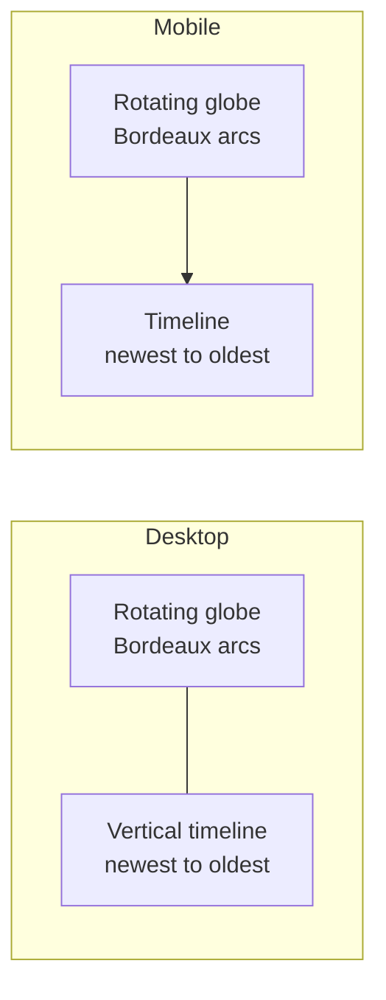
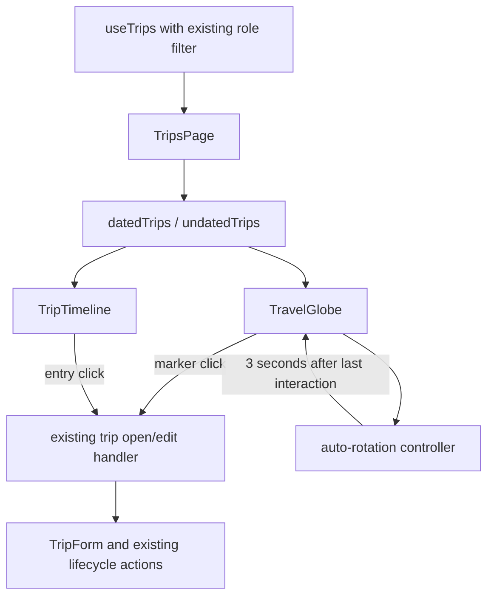

# Authenticated Home Redesign - Plan

## Goal Capsule

- **Objective:** Replace the authenticated home with a globe-centered travel overview and a chronological travel timeline.
- **Product authority:** The Product Contract below is the source of truth for behavior and scope. The existing GraphQL schema, role checks, and trip-management flows remain authoritative where the contract says to preserve them.
- **Implementation profile:** One backend validation unit and two frontend units, followed by the repository verification gates.
- **Tail ownership:** The executor owns implementation, tests, simplification, review, and the final `make check`; no generated GraphQL file is edited manually.
- **Stop conditions:** Stop and surface a blocker only if the selected globe package cannot build or run with the repository's React/Vite/Three.js dependency graph, or if an existing preserved management flow cannot be represented in the new layout without changing its product behavior.

## Product Contract

### Summary

The authenticated home will present the user's visible trips as a visual travel story: a continuously rotating globe centered on trips departing from Bordeaux, paired with a timeline ordered from the most recent trip to the oldest. The same home will support the existing read and edit capabilities while preserving the application's current color system and role-based visibility.

### Problem Frame

The current home provides a world map and a trip list, but it does not express the relationship between the user's home base, the places visited, and the chronology of the trips as one coherent overview. The supplied desktop and mobile references establish a stronger visual hierarchy around the globe and the timeline.

The redesign must improve this overview without introducing a second product model for trips or removing the management actions that administrators and editors already use.

### Actors

- A1. Connected user who browses visible trips and opens an existing trip.
- A2. Connected administrator or editor who also manages trips from the home in edit mode.

### Requirements

#### Globe and geographic relationships

- R1. The authenticated home MUST display a globe as the primary geographic representation of visible trips.
- R2. The globe MUST represent each visible trip at its stored destination and MUST draw a visual arc from the fixed Bordeaux origin to that trip.
- R3. All home-to-trip arcs MUST use one shared golden color that is consistent with the existing application color system.
- R4. The globe MUST rotate continuously when the user is not interacting with it.
- R5. Manual globe interaction MUST remain available for rotation and zooming.
- R6. Manual interaction MUST pause automatic rotation, and automatic rotation MUST resume three seconds after the user's last interaction.

#### Timeline and trip visibility

- R7. The home MUST display the same role-based trip visibility as the current application.
- R8. The timeline MUST order dated trips from the most recent start date to the oldest start date.
- R9. Trips without a start date MUST appear in a separate `À planifier` section rather than in the dated timeline.
- R10. A trip MUST NOT be publishable without a start date.
- R11. Timeline entries MUST provide the existing trip identity and navigation information, including the trip title, country, cover when available, and date/status information appropriate to the trip state.

#### Responsive home layout

- R12. On desktop, the globe MUST occupy the primary area and the timeline MUST appear as a companion vertical panel.
- R13. On mobile, the globe MUST appear before the timeline in a vertical layout.
- R14. The layout MUST preserve the existing application color palette and visual vocabulary rather than adopting the colors from the AI-generated reference literally.

#### Existing behavior and editing

- R15. Selecting a trip from the globe or timeline MUST preserve the current trip-opening behavior.
- R16. The redesigned home MUST preserve the current trip management actions in edit mode, including creating, editing, publishing, unpublishing, closing, reopening, and deleting trips where each action is currently allowed.
- R17. The redesign MUST apply to edit mode as well as read mode; edit mode MUST remain usable from the new globe-and-timeline home.
- R18. The first version MUST keep the current feature set and MUST NOT add the reference's `Explorer par Pays` or `Galerie Photos` actions.

### Key Decisions

- KTD1. **Fixed Bordeaux origin:** use one application-wide origin instead of a per-user domicile or an arc-less fallback. (session-settled: user-directed — chosen over a configurable or absent domicile: the home is anchored to Bordeaux for this product.) Governs R2.
- KTD2. **Shared golden arcs:** use one golden arc color instead of one color per trip. (session-settled: user-directed — chosen over per-trip colors: the arcs should remain visually coherent and follow the existing palette.) Governs R3.
- KTD3. **Continuous but interruptible globe motion:** rotate continuously, allow manual rotation and zoom, then resume three seconds after interaction. (session-settled: user-approved — chosen over static or manual-only motion: the globe remains lively without fighting the user.) Governs R4, R5, R6.
- KTD4. **Current role visibility:** retain the existing visibility rules instead of exposing every trip to every connected user. (session-settled: user-directed — chosen over all-trips-for-all-users: existing access behavior must remain stable.) Governs R7.
- KTD5. **Separate planning section:** keep undated trips in `À planifier` instead of placing them at the top or bottom of the dated timeline. (session-settled: user-directed — chosen over mixing them into date order: undated trips have a distinct planning state.) Governs R8, R9.
- KTD6. **Home-wide editing:** apply the redesign to edit mode and keep the current management actions available there. (session-settled: user-directed — chosen over leaving the existing edit page unchanged: the home is the shared entry point for reading and management.) Governs R16, R17.
- KTD7. **Current feature surface:** preserve existing functionality and omit the two new reference actions. (session-settled: user-directed — chosen over adding discovery shortcuts: this iteration focuses on the globe-and-timeline home.) Governs R15, R18.

### Key Flows

- F1. **Open the home**
  - **Trigger:** A connected user opens the application home.
  - **Actors:** A1 or A2.
  - **Steps:** The home loads the trips allowed by the user's role, displays them on the globe, and places dated trips in the timeline while grouping undated trips under `À planifier`.
  - **Outcome:** The user can understand the geographic and chronological trip overview without opening a trip.
  - **Covers:** R1, R2, R7, R8, R9, R12, R13.
- F2. **Explore the globe**
  - **Trigger:** The user leaves the globe idle or starts a manual interaction.
  - **Actors:** A1 or A2.
  - **Steps:** The globe rotates while idle; a manual rotation or zoom pauses the automatic motion; the motion resumes three seconds after the last interaction.
  - **Outcome:** The user gets ambient motion and retains control of the globe.
  - **Covers:** R4, R5, R6.
- F3. **Open a trip**
  - **Trigger:** The user selects a trip marker or timeline entry.
  - **Actors:** A1 or A2.
  - **Steps:** The application applies the current trip navigation behavior.
  - **Outcome:** The user reaches the existing trip experience without losing access to current functionality.
  - **Covers:** R15.
- F4. **Manage trips from the home**
  - **Trigger:** An administrator or editor activates edit mode.
  - **Actors:** A2.
  - **Steps:** The home remains the globe-and-timeline view; the existing trip management actions remain available from the home wherever the current role and trip state permit them.
  - **Outcome:** The user can continue managing trips without switching to a separate legacy home layout.
  - **Covers:** R16, R17, R18.

### Acceptance Examples

- AE1. **Idle globe motion:** Given a connected user is viewing the home and is not interacting with the globe, when the home remains open, then the globe continues rotating. Covers R4.
- AE2. **Manual globe interaction:** Given the globe is rotating automatically, when the user drags or zooms the globe, then automatic rotation pauses and resumes three seconds after the last interaction. Covers R5, R6.
- AE3. **Role-based home content:** Given a connected user has the same role and access context as in the current application, when the user opens the home, then the home shows the same set of trips that the current home would show for that role. Covers R7.
- AE4. **Undated trip:** Given a visible trip has no start date, when the user opens the home, then the trip appears under `À planifier` and not in the dated timeline. Covers R8, R9.
- AE5. **Published trip date requirement:** Given an administrator or editor edits a trip without a start date, when the user attempts to publish it, then publishing is rejected, an error is shown, and the trip remains unpublished until a start date is provided. Covers R10.
- AE6. **Edit mode continuity:** Given an administrator or editor activates edit mode on the redesigned home, when the user selects a trip and performs an action currently allowed for that trip state, then the action remains available and uses the existing behavior. Covers R16, R17.

### Scope Boundaries

- The first version does not add `Explorer par Pays` or `Galerie Photos` shortcuts from the reference.
- The domicile is not configurable per user in this work.
- The globe arcs are visual relationships from Bordeaux to destinations; they are not route calculations and do not replace travel-leg distance logic.
- Broader changes to trip detail pages, media galleries, and travel-leg management are outside this home redesign.

### Dependencies and Assumptions

- Existing role-based trip visibility remains the source of truth for the home.
- Trips continue to provide the destination coordinates, cover information, dates, and status needed by the home.
- Existing trip navigation and management actions remain valid entry points and are reused rather than redefined.
- The Bordeaux origin can be represented by a stable application-level location in the frontend.

### Success Criteria

- A connected user can identify visible trips by geography and chronology from the home without opening each trip.
- Globe motion feels ambient when idle and does not fight manual interaction.
- The same role visibility and trip management capabilities remain available after the redesign.
- Undated trips are clearly separated from dated trips, and published trips cannot bypass the start-date rule.
- The desktop and mobile layouts follow the supplied visual direction while remaining consistent with the existing application palette.

## Planning Contract

### Product Contract preservation

Product Contract unchanged. This section only chooses the implementation shape needed to satisfy R1–R18 and does not add product scope.

### Key Technical Decisions

- KTD8. **Use the React binding for globe.gl:** pin `react-globe.gl@2.38.0` and use its declarative `arcsData`, `pointsData`, `onPointClick`, `onGlobeClick`, `onZoom`, and exposed `controls()` rather than managing a raw Three.js scene. This matches the existing React architecture and directly supports the required arcs, destination markers, placement, zoom, and auto-rotation through the OrbitControls object. The official package metadata and API documentation expose these surfaces: [package metadata](https://raw.githubusercontent.com/vasturiano/react-globe.gl/master/package.json) and [API reference](https://github.com/vasturiano/react-globe.gl).
- KTD9. **Keep the current trip query and role filter:** `TripsPage` continues to call `useTrips(undefined)` for ADMIN/EDITOR and `useTrips(['PUBLISHED', 'CLOSED'])` for other roles. No new visibility query or persisted home preference is introduced.
- KTD10. **Split dated and undated trips at the page boundary:** retain the backend's start-date descending ordering, then derive `datedTrips` and `undatedTrips` in the page or a small pure utility. The `À planifier` group is rendered separately and is not passed into date labels that assume a range.
- KTD11. **Keep lifecycle actions in the existing edit surface:** the timeline entry opens the existing `TripForm` in edit mode, and the current close/delete confirmation flows remain owned by `TripsPage`. Change `FormAction.onClick` to return `void | Promise<string[] | void>`; `TripForm` awaits it, renders returned messages in its existing error area, stays open on errors, and disables the action while it is pending. Publish errors returned in the GraphQL payload must be surfaced in that form instead of being silently discarded.
- KTD12. **Use a fixed frontend origin:** store Bordeaux's latitude/longitude in a named constant next to the globe data adapter. Do not add origin fields to GraphQL, PostgreSQL, or trip domain models.
- KTD13. **Use one globe interaction controller:** the globe component owns the three-second resume timer, clears it on every pointer/touch/zoom interaction, enables controls' auto-rotation only after the timer, and clears the timer on unmount. The page owns trip selection; the globe does not duplicate navigation rules.
- KTD14. **Make the timeline the accessible trip-selection path:** globe points expose labels/tooltips and pointer selection, while every trip remains reachable as a real keyboard-focusable link or button in the timeline. The canvas does not become the only route to a trip.
- KTD15. **Use an explicit placement mode:** in edit mode, a visible `Placer un voyage` control toggles globe placement. While active, clicking the globe calls `onLocationSelect({ lat, lng })` and updates `pendingCoords`; clicking a trip marker still selects that trip; leaving the mode cancels the pending placement. Dragging/zooming remains globe navigation and does not create a trip. This preserves the current `WorldMap.onMapClick` capability without making every globe click destructive.

### High-Level Technical Design

The page becomes a two-part composition: `TravelGlobe` receives the visible trip summaries and renders destination points plus Bordeaux-origin arcs; `TripTimeline` receives the same summaries and renders dated and undated sections. The page keeps the existing GraphQL hooks, role calculation, form drawer, close-data query, and delete modal, while replacing `WorldMap` and the legacy list/toggle layout.

The globe data mapping stays inside `TravelGlobe.tsx` until a second consumer exists. It maps each trip's stored `lat`/`lng` to a point and to an arc ending at that coordinate. Bordeaux is the common arc start. A trip with invalid or missing coordinates must not crash the globe; the timeline remains usable and the implementation should follow the existing coordinate assumptions and log only a scoped rendering error if the package reports one.

Desktop uses a wide primary globe area and a companion scrollable timeline panel. Mobile uses one column with the globe first and the timeline below it. The layout must account for the fixed application header and avoid making the globe the only way to reach a trip.

### Assumptions and constraints

- `TripsQuery` already includes every field required by the home: `id`, `title`, `country`, `lat`, `lng`, `startDate`, `endDate`, `status`, and `coverPhoto`.
- `formatDateOnly` is the date-display helper and must continue to interpret date-only GraphQL values in UTC, avoiding the timezone regression previously seen in the UI.
- The existing `TripCard` cover fallback and status labels are reusable or can be moved into the timeline entry without changing their semantics.
- The globe package is a client-side dependency. The implementation must avoid accessing `window`, WebGL, or the globe ref during server-independent test rendering.
- Generated GraphQL artifacts under `frontend/src/graphql/generated/` and `backend/internal/graphql/generated.go` remain generated outputs and are changed only through the repository's code-generation commands if a schema change becomes necessary. This plan expects no schema change.

### Sequencing

U1 can be implemented independently. U2 establishes the globe component and its local data mapping. U3 integrates the globe and timeline into the page and preserves edit behavior. The final verification pass runs after U1–U3 and includes the browser-facing checks appropriate to the new home.

## Implementation Units

### U1. Enforce a start date before trip publication

- **Goal:** Make the domain and GraphQL publish path reject drafts without a start date, return a business error through the existing `errors` payload, and keep the trip in draft status.
- **Requirements:** R10, AE5, and the preserved lifecycle behavior in R16.
- **Files:** `backend/internal/domain/trip/model.go`, `backend/internal/graphql/errors.go`, `backend/internal/domain/trip/steps_lifecycle_test.go`, `backend/internal/domain/trip/testdata/gestion-des-voyages.feature`, `specs/web-application/gestion-des-voyages.feature`, `backend/cmd/server/graphql_integration_test.go`.
- **Approach:** Add a dedicated domain error for a missing start date and check it in `Trip.Publish()` before changing status. Map it to a useful GraphQL `UserError`, preferably with `field: startDate`, following the existing error mapping. Add a dedicated Godog setup step that creates an undated draft (the existing draft step always supplies dates), then assert both the error and unchanged draft state. Extend the existing GraphQL integration test file with a publish-without-date request that asserts the `startDate` error, no GraphQL transport error, and unchanged `DRAFT` status. Keep the existing publish mutation and generated files unchanged.
- **Frontend contract:** Update the page/form action handling in U3 so the payload error is shown to the editor rather than ignored.
- **Test scenarios:** publishing a dated draft succeeds; publishing an undated draft returns the new error and leaves status `DRAFT`; the GraphQL payload contains `errors` and no published trip.
- **Verification:** run the focused trip domain feature test and the named GraphQL integration test, then include this behavior in `make check`.
- **Dependencies:** none.

### U2. Build the Bordeaux globe surface

- **Goal:** Introduce a tested React globe component that renders visible trip destinations, shared golden arcs from Bordeaux, marker selection, and interruptible continuous rotation.
- **Requirements:** R1–R6, R15, and R14.
- **Files:** `frontend/package.json`, `frontend/package-lock.json`, `frontend/src/features/trips/components/TravelGlobe.tsx`, `frontend/src/features/trips/components/TravelGlobe.module.css`, `frontend/src/features/trips/components/TravelGlobe.test.tsx`.
- **Approach:** Add the pinned React binding supported by the official globe.gl project. Define the Bordeaux origin and shared gold color as named constants. Map trip summaries to `pointsData` and `arcsData`, attach marker selection to the existing page callback, expose `placementMode`/`onLocationSelect`, configure controls for auto-rotation, and pause/resume using a ref-backed timer. The component must clean up timers and remain testable with a mocked globe binding or a narrow module boundary. On a globe initialization/WebGL failure, report a contained error state to U3 rather than throwing through the page.
- **Interaction details:** Any drag, zoom, pointer, touch, or control interaction resets the three-second timer. A new interaction cancels the previous timer. Unmount cancels pending work. Placement mode is enabled only by an explicit edit-mode control; an empty-globe click selects coordinates only while that mode is active. Marker selection and placement are mutually exclusive. Globe points carry labels for pointer users, while U3 provides the canonical keyboard path.
- **Test scenarios:** all valid visible trips produce one marker and one Bordeaux arc; all arcs use the same gold; selecting a marker invokes the page callback with the right trip; placement mode maps an empty-globe click to `onLocationSelect` and does not invoke trip selection; idle controls are configured to rotate; an interaction disables auto-rotation; fake timers re-enable it at 3000 ms and not earlier; unmount clears the timer; a mocked initialization error renders the contained error state.
- **Verification:** run the focused Vitest file and frontend typecheck/build after installing `react-globe.gl@2.38.0`. Confirm the lockfile resolves the package's globe.gl dependency without a duplicate Three.js runtime or React compatibility error.
- **Dependencies:** none, but U3 consumes this component.

### U3. Replace the home layout with the globe and timeline

- **Goal:** Integrate the new globe and a responsive chronological timeline into both read and edit modes while preserving current visibility, navigation, creation, editing, lifecycle, close, and delete behavior.
- **Requirements:** R7–R9, R11–R18, F1, F3, F4, AE3, AE4, AE6.
- **Files:** `frontend/src/features/trips/pages/TripsPage.tsx`, `frontend/src/features/trips/pages/TripsPage.module.css`, `frontend/src/features/trips/pages/TripDetailPage.tsx`, `frontend/src/features/trips/components/TripTimeline.tsx`, `frontend/src/features/trips/components/TripTimeline.module.css`, `frontend/src/features/trips/components/TripTimeline.test.tsx`, `frontend/src/features/trips/components/TripCard.tsx`, `frontend/src/features/trips/components/TripCard.module.css`, `frontend/src/features/trips/components/TripForm.tsx`, `frontend/src/features/trips/pages/TripsPage.test.tsx`, `frontend/e2e/auth.spec.ts`, and removal of now-unused `frontend/src/features/trips/components/WorldMap.tsx`, `frontend/src/features/trips/components/WorldMap.module.css`, `frontend/src/features/trips/utils/countryCoords.ts`, and `frontend/src/react-simple-maps.d.ts` plus their `react-simple-maps`, `@types/react-simple-maps`, `d3-geo`, and `@types/d3-geo` dependencies if repository-wide search confirms no other consumers.
- **Approach:** Replace `WorldMap` and the legacy panel/toggle composition with the new desktop two-column and mobile stacked layout. Derive dated and undated groups without changing the query or role filter. Render the existing card identity, cover fallback, status, and date formatting in timeline entries. Route both timeline and globe selection through the current `handleCardClick` behavior: read mode navigates to `/trips/:id`; edit mode opens `TripForm`. Preserve creation and coordinate placement with an explicit `placementMode` toggle on `TravelGlobe`: while active, `onGlobeClick` calls the existing `handleMapClick`, updates `pendingCoords`, and shows the pending location; an explicit cancel exits placement without changing the trip. Clicking a marker selects/opens the trip and never places a new one.
- **Edit-mode behavior:** Preserve `TripForm`, cover choices, close-data loading, delete confirmation, and all lifecycle actions. Implement the KTD11 action contract in `TripForm` and both current consumers (`TripsPage` and `TripDetailPage`) so mutation payload errors are returned to the form, rendered in its existing error area, and do not close the form. Successful mutations continue to invalidate the `Trip`/`trips` cache through the current client updates. Keep the existing right-side drawer overlay semantics; focus the first form control when it opens, return focus to the trigger when it closes, and preserve the existing responsive full-width behavior without converting the drawer into a new modal abstraction. Do not add the two reference shortcuts.
- **State matrix:** While the query is fetching, show a globe/timeline loading presentation and do not show the loaded-empty message. On a query error, show the existing load error in the page region. With zero trips, show an empty globe surface and an explicit empty-state message, plus the existing create affordance in edit mode. With only undated trips, show the globe arcs/markers and only the `À planifier` timeline section. With invalid coordinates, omit only the affected globe point/arc and retain its timeline entry. On WebGL initialization failure, show an accessible message in the globe region while keeping the timeline and all trip actions usable.
- **Responsive and visual details:** Use the existing CSS variables, typography, radii, borders, and gold tokens. Give the globe an explicit responsive aspect ratio and keep the timeline independently scrollable on desktop. On mobile, keep the globe before the timeline and avoid a permanently hidden list. Ensure timeline controls are real links/buttons with visible keyboard focus styles and accessible labels; the globe is an enhancement, not the only accessible trip-selection path.
- **Test scenarios:** dated trips render newest first; undated trips render only under `À planifier`; role-filtered query variables remain unchanged; clicking a timeline entry navigates in read mode and opens the form in edit mode; edit-mode create/edit/publish/unpublish/reopen/delete controls remain present for eligible states; a publish error is visible and does not close the form; placement mode selects coordinates and can be cancelled; loading, query-error, empty, undated-only, invalid-coordinate, and WebGL-error states match the matrix; the layout renders in desktop and mobile viewport sizes without depending on `isMobileViewport` at module load time; the existing `frontend/e2e/auth.spec.ts` assertions are updated to the new authenticated home.
- **Verification:** run focused component tests, then frontend lint, typecheck, build, and update/run `frontend/e2e/auth.spec.ts`, which currently authenticates through setup and asserts the old home heading.
- **Dependencies:** U2; U1 for the final publish-error behavior.

## Verification Contract

### Focused checks

- Backend: run the trip domain feature test covering `backend/internal/domain/trip/testdata/gestion-des-voyages.feature` and the publish-without-date integration coverage in `backend/cmd/server/graphql_integration_test.go`.
- Frontend: run the new globe, timeline, and home page Vitest tests with `npm test -- --run` from `frontend/` or the repository's equivalent focused command.
- Frontend static checks: run `npm run typecheck`, `npm run lint`, and `npm run build` from `frontend/`.
- Browser behavior: update and run `frontend/e2e/auth.spec.ts` for the redesigned authenticated home; add only the minimum authenticated assertions needed for the globe/timeline entry path. Do not change Playwright configuration unless the existing project setup requires it.

### Repository gates

- `make check-generated` must pass and generated GraphQL files must not be manually edited.
- `make check` is the completion gate and must pass before the work is considered finished.
- `make check-fast` may be used during iteration but does not replace `make check`.

### Behavioral checks

- Verify the role-dependent status filter remains the same for administrator/editor versus other connected users.
- Verify undated trips are excluded from the dated timeline but remain visible in the globe and planning section.
- Verify a missing start date cannot publish through the UI or directly through the GraphQL mutation.
- Verify auto-rotation resumes after exactly the three-second quiet period and stops responding to globe movement while the user is interacting.
- Verify the timeline remains usable if WebGL is unavailable or the globe component cannot initialize; the fixed fallback is an accessible message in the globe region, while trip navigation and management remain available.

## Risks & Dependencies

- **Globe dependency compatibility:** `react-globe.gl` brings a Three.js/WebGL runtime into a frontend that currently uses SVG and Leaflet maps. Pin a compatible version in the lockfile, verify the production build, and keep the globe behind a component boundary so a future library replacement does not affect trip state.
- **WebGL/runtime support:** Some browsers or test environments may not expose WebGL. The fixed fallback is a contained accessible message in the globe region; the timeline remains fully functional and no second map implementation is added.
- **Interaction event coverage:** Globe control events can differ by library version. Verify the actual event/ref API against the installed version and cover the timer behavior with a mock rather than relying only on visual QA.
- **Edit-mode regression:** The current home owns several mutations and a close-data query. Keep those callbacks in `TripsPage` and test them through the page so the visual replacement does not silently remove management actions.
- **Date semantics:** Date-only strings must continue using `formatDateOnly`; no `new Date('YYYY-MM-DD')` formatting is allowed in the new timeline.

## Definition of Done

### Global

- [ ] The authenticated home matches R1–R18 and the Product Contract remains unchanged.
- [ ] The desktop and mobile layouts use the existing color tokens and preserve current navigation and edit-mode capabilities.
- [ ] Bordeaux-to-trip arcs, shared gold styling, marker selection, continuous rotation, manual controls, and three-second resume behavior are implemented and tested.
- [ ] Dated trips are sorted newest-first, undated trips are grouped under `À planifier`, and published trips require a start date through domain and GraphQL paths.
- [ ] No reference-only `Explorer par Pays` or `Galerie Photos` action is introduced.
- [ ] No generated GraphQL file is manually edited and no unrelated feature is changed.
- [ ] Abandoned experiments, dead components, temporary logging, and unused dependency paths are removed, including the legacy home-only `react-simple-maps` surface when repository-wide search confirms it has no remaining consumer.
- [ ] `make check-generated`, `make check-fast`, and `make check` pass, with any environment limitation reported verbatim before delivery.

### Per unit

- [ ] U1 has a domain-level missing-start-date error, GraphQL `errors` mapping, Gherkin coverage, and unchanged draft status on rejection.
- [ ] U2 has isolated globe data mapping, interaction timer cleanup, shared gold arcs, marker callbacks, and deterministic tests.
- [ ] U3 has dated/undated timeline rendering, responsive layout, preserved read/edit flows, publish error presentation, and page-level regression tests.

## Appendix

### Sources / Research

- `frontend/src/features/trips/pages/TripsPage.tsx`: current home owner, role-based query variables, edit-mode actions, close-data loading, and delete confirmation.
- `frontend/src/features/trips/components/WorldMap.tsx`: current geographic surface and the map-placement behavior that must be consciously replaced or retained through an edit affordance.
- `frontend/src/features/trips/components/TripCard.tsx`: current trip identity, cover fallback, status labels, and date formatting.
- `frontend/src/features/trips/components/TripForm.tsx` and `frontend/src/features/trips/hooks/useTripMutations.ts`: current edit form, lifecycle action boundary, and GraphQL payload shape.
- `frontend/src/features/trips/hooks/useTrips.ts`: current `TripsQuery` fields and role-filtered list input.
- `frontend/src/index.css`: existing palette and layout tokens, including `--color-gold`, `--color-text`, `--color-bg`, and `--header-height`.
- `backend/internal/domain/trip/model.go`: current lifecycle model; `Publish()` currently changes status without checking `StartDate`, which is the U1 gap.
- `backend/internal/domain/trip/handler.go`: current start-date descending list ordering and publish delegation.
- `backend/internal/graphql/errors.go` and `backend/internal/graphql/schema.resolvers.go`: existing business-error-to-GraphQL-payload path.
- `specs/web-application/gestion-des-voyages.feature`: functional source for trip lifecycle and date-order behavior.
- `https://github.com/vasturiano/react-globe.gl`: official React binding documentation and API surface used to justify KTD8.
- `https://raw.githubusercontent.com/vasturiano/react-globe.gl/master/package.json`: official package metadata used to pin and validate the selected React binding.
- `https://github.com/vasturiano/globe.gl`: official globe.gl project documentation and rendering capabilities.

### Deferred, non-blocking choices

- Exact globe camera latitude/longitude, zoom bounds, arc altitude, animation duration, marker iconography, and card spacing are implementation polish choices constrained by the supplied references and existing palette.
- The exact copy and styling of the fixed WebGL error message can be chosen during implementation; it must remain accessible and must not replace the timeline or current trip actions.
